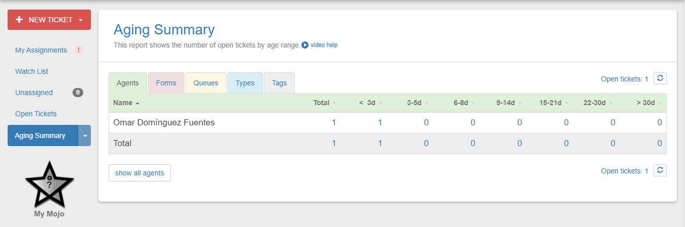
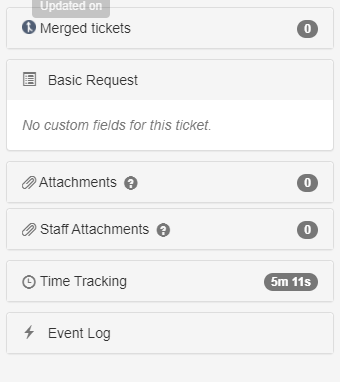

# Mojo Helpdesk

## ¿Qué es Mojo Helpdesk?

Es una herramienta utilizada por gestores de servicio técnico y administradores de sistemas que requieran un software dedicado a la asignación de servicio técnico y el seguimiento del mismo mediante generación de solicitudes internas, o bien de asistencia a otro empleado o bien de asistencia al cliente directamente.

Permite a los administradores hacer un seguimiento de los tickets de los clientes, además de crearlos, asignarlos o resolverlos sobre la marcha (autoasignación).

Para más información se recomienda visitar el apartado de [características](https://www.mojohelpdesk.com/features/) de la página oficial. Para ver las últimas se puede visitar su [blog](https://www.mojohelpdesk.com/blog/).

## Compra de Mojo Helpdesk

Mojo Helpdesk permite usar una prueba de 14 días para probar el servicio pero cuenta con distintos tipos de contratos de suscripción:

- El plan de suscripción **mensual** no ofrece ningún descuento.
- El plan de suscripción **anual** ofrece un **10%** de descuento.
- El plan de suscripción **anual para usos educativos** ofrece un **40%** de descuento.

## Aprendizaje

Helpdesk Mojo ofrece una serie de recursos para que todos los usuarios puedan usar las características del servicio sacándoles el máximo partido.

- [Vídeos educativos y tutoriales.](https://www.mojohelpdesk.com/how-to-videos/)

- [Consejos para asistentes.](https://www.mojohelpdesk.com/helpdesk-training-guide/)

- [Asistencia directa.](https://help.mojohelpdesk.com/)

## Creación de Cuenta en Mojo Helpdesk

Haremos una pequeña guía de uso con la versión de prueba de 14 días que se nos ofrece. Para ello primeramente venimos a la [página principal](https://www.mojohelpdesk.com/) y seleccionamos la opción "Start a Trial".

Seguidamente nos pedirá que introduzcamos una dirección de correo para nuestro registro.

**NOTA**: Utilizar un correo al que se tenga acceso.

Seguiremos introduciendo nuestro nombre y apellidos.

Por último nos pedirá que creemos un nombre para nuestro subdominio. Este será, en mi caso, "iesdpm.mojohelpdesk.com".

Mojo Helpdesk es una utilidad que no requiere de instalación alguna, pues los servicios los ejecutaremos desde el propio navegador.

## Guía de Uso

Tan pronto como empezamos, se nos ofrece una guía rápida sobre el funcionamiento de Mojo Helpdesk.

### Guía Básica

En la esquina superior izquierda podremos ver el apartado "My assignments", donde podremos ver todos los tickets que tenemos asignados a nuestra cuenta.

Justo debajo tenemos el apartado "Unassigned". Aquí encontraremos todos los nuevos tickets que aún no se han asignado y, como administradores podremos, o bien asignarlos a otro empleado, o bien asignárnoslo a nosotros mismos.

En el apartado "Dashboard" podremos hacer un seguimiento para el control de los tickets y los agentes que los llevan.

En "My Mojo", encontraremos una herramienta interactiva que nos evalúa y nos puntúa según resolvemos tickets y los clientes proporcionan algún tipo de feedback. En esencia se trata de una estadística de satisfacción de nuestros clientes, la cual podemos deshabilitar si así lo preferimos.

Podremos por otro lado, crear una guía o guías con soluciones a problemas comunes y facilitarles el acceso a los agentes para poder agilizar el proceso de resolución de tickets.

El usuario administrador podrá realizar asignaciones y configuraciones en la siguiente pestaña

En último lugar tenemos la asistencia personalizada del servicio de soporte.

### Configuración de Mojo

#### Usuarios y notificaciones.

Para crear nuevos usuarios vendremos a "Admin Settings" y "Agents". Aquí seleccionaremos la opción "New User".

Introducimos los credenciales del nuevo usuario y le añadimos un rol (esto decidirá los permisos que tiene).

Para ajustar las notificaciones iremos a "Admin Settings" y "Queues & Email Addresses". Aquí podremos indicar nuevos grupos de organización de notificaciones. Podremos crear etiquetas para agrupar por categorías las notificaciones e indicar que se almacenen en una o en otra según el correo de procedencia.

Rellenaremos con los campos necesarios.

Por último, podemos ir a "New Ticket Notifications" para configurar a qué usuario le llega uno o varios tipos de tickets. Aquí podremos configurar las preferencias por usuario. Por ejemplo, añadiré a mi usuario que sólo me lleguen los tickets de Administración y "Billing".

****

#### Opciones avanzadas

Podemos automatizar muchos de los procesos de nuestra generación de tickets y notificaciones mediante triggers. Veamos los que ya están dentro del propio programa. Para ello vamos a "Admin-Settings" y a "Triggers".

- El primero de todos nos dice que, en caso de que un ticket esté marcado como emergencia, notificará a todo el equipo.
- El segundo dictamina que, cuando se hace un comentario en un ticket sin asignar, se notifique a todo el equipo.
- El último dice que se le envíe un correo al cliente que creó el ticket cuando este se catalogue como solucionado.

**NOTA:** Para crear nuevos triggers, seleccionaremos la opción de "new".

Por otro lado, podemos automatizar algunas acciones según el tiempo. Para ello accederemos a "Admin-Settings" y a "Automations". Veamos el que ya viene configurado de serie.

**NOTA:** Para crear nuevas automatizaciones, seleccionaremos la opción de "new".

#### Reporte

En la tabla localizada en la porción izquierda veremos la opción "Dashboard". Si accedemos a ella podremos filtrar los tickets que tenemos.

Si desplegamos los filtros, podremos buscar los tickets de los campos que nos interesan.

Podremos desplegar también el "Again Summary" en la misma tabla que el Dashboard.

Este nos devolverá el registro de los tickets creados según tiempo y clasificación.

### Administración de Tickets

### Creación de Tickets

Como administradores podemos crear tickets directamente desde aquí:

Sin embargo, tal y como indicamos antes, podemos poner a disposición de los usuarios (tanto agentes como clientes) una serie de información de ayuda, para que puedan resolver los problemas. Existen dos tipos:

- **Pública:** A la que tienen acceso tanto los agentes como los clientes.
- **Privada:** A la que tienen acceso solo los agentes.

Aquí podremos acceder a esta información:

Se nos abrirá la siguiente página:

Como ya explicamos antes, aquí podríamos buscar información de nuestro problema antes de crear un nuevo ticket o también, cumplido con nuestra función de administradores, podríamos documentar cualquier problema que haya ocurrido en el pasado para que aparezca en futuras búsquedas, ayudando tanto a agentes como a clientes.

En caso de que no exista solución para nuestro problema, deberemos presionar el botón situado en la parte superior derecha de la pantalla llamado "New Ticket". Esto nos abrirá el siguiente formulario que, una vez cumplimentado, notificará a los agentes pertinentes (los que hayamos definido en función al problema que se llame).

Esto sería creando un ticket desde el lado de administrador. Veamos los tickets desde el lado del cliente.

Para crear el ticket desde el cliente, tenemos el botón de creación en la misma disposición. Una vez entremos, simplemente tendremos que cumplimentar el ticket con los datos que se nos pidan.7

#### Responder a los Tickets

Una vez los tickets estén creados podemos hacer varias cosas. Primeramente, como administradores podemos asignar los tickets a otros usuarios o nos los podemos asignar a nosotros mismos. Es este último paso el necesario para poder resolver una incidencia por nosotros. Si existen otros administradores puede ser común que veamos asociados a nuestra cuenta algunos tickets que nos hayan asignado.

Podemos ver los tickets de tres formas:

- En "My Assignments" tendremos los tickets que nos hemos asignado o nos han asignado.

- En "Unassigned" están los tickets que no tienen usuarios asignados, es decir que podemos asignarnos a nosotros mismos o asignarlos a alguien.

- En "Open Tickets" tenemos todos los tickets que siguen abiertos.

Para asignar a alguien los tickets o asignarnos alguno a nosotros mismos, debemos marcar el usuario asignado en el apartado señalado en la siguiente imagen:

Podremos ver que se nos despliegan tantas opciones como usuarios tengamos disponibles para la resolución de problemas.

Una vez nos hayamos asignado el ticket, podremos responderlo. Pincharemos en él y abriremos el asistente de respuesta ante la necesidad que propone el ticket.

Pincharemos en "Reply to User" si queremos solucionar directamente el problema o en "Add staff note" si queremos añadir al ticket información relevante para que cualquier otro agente que vaya a resolver el ticket pueda usarla.

Para este ejemplo voy a añadir una respuesta:

**NOTA:** Podemos marcar la casilla inferior, que mandará una notificación al usuario que ha creado el ticket ante mi respuesta.

Una vez hayamos publicado la respuesta, veremos como el sistema de tickets toma forma de una comunicación entre cliente y agente para solucionar un problema.

#### Detalles de los tickets

Cuando abrimos un ticket, en la porción izquierda de la pantalla podemos ver toda la información relevante del mismo.

- En la primera porción veremos su identificación, su estado (resuelto, abierto, ... ), el grupo al que fue asignado, el agente que se le ha asignado y las fechas de creación, asignación y modificación.

- El resto es información complementaria como datos adjuntos del cliente, datos adjuntos del personal, tiempo de seguimiento, ...

## Referencias

### Información sobre el producto

- https://www.capterra.es/software/128650/mojo-helpdesk
- https://mojohelpdesk.com/features/

- https://www.softwareadvice.es/software/31113/mojo-helpdesk

### Configuración

Me he guiado completamente del asistente que proporciona el fabricante en la web. Facilita cada uno de los campos junto a una explicación paso a paso.

## Créditos

- Omar Domínguez Fuentes.